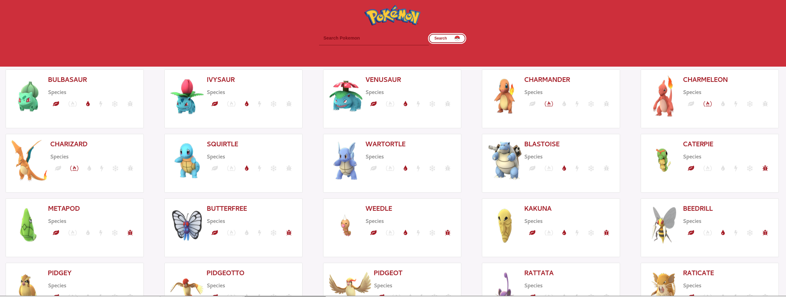

# Pokedex Application

## Description
A Pokemons list(Pokedex) with search input.

## Instalation

1. Clone the repo: git remote add origin git@github.com:alexandrejuk/pokemon-react.git
2. cd pokemon-react
3. Install packages: npm install or yarn
4. Build project and launch: npm start or yarn start
5. Start api with json server: json-server db.json --port 3002
5. Open your browser at: http://localhost:3000

## Screenshot

## Author
[Alexandre dos Santos Soares](https://github.com/alexandrejuk)